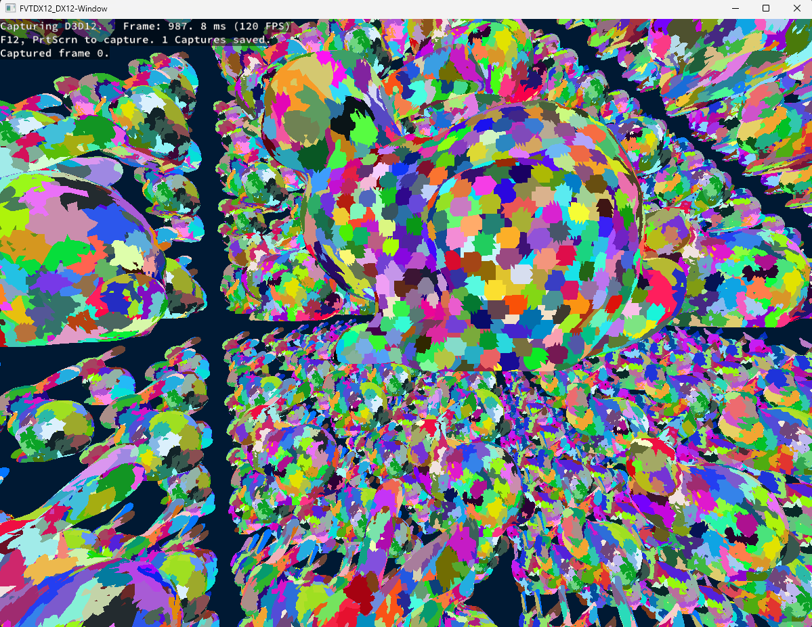
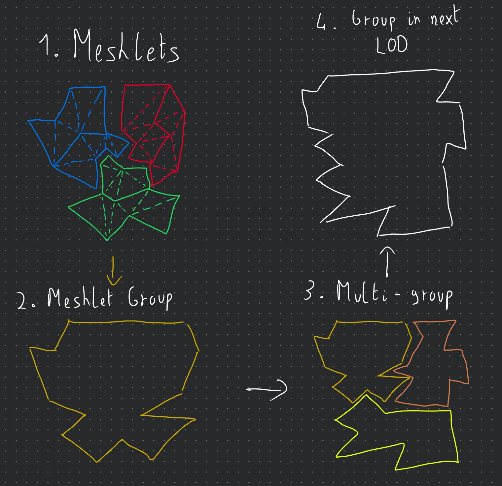
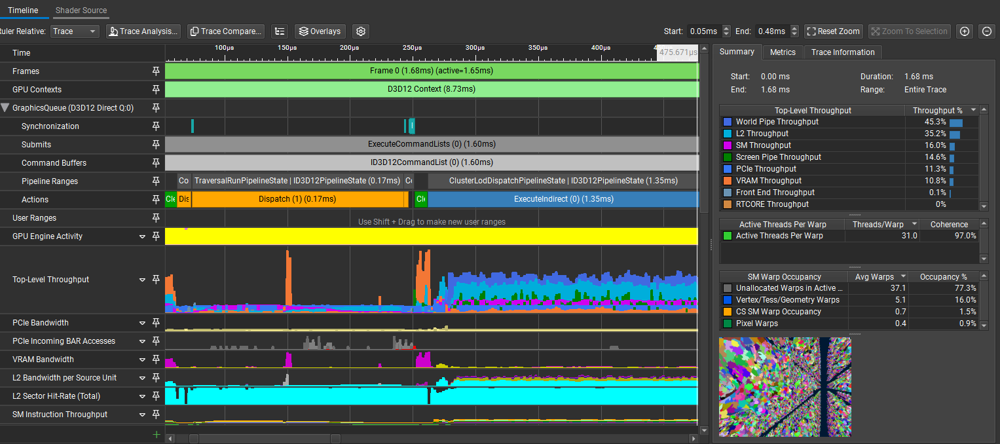

# Nanite-Style Hierarchical Meshlet LODs 101

<figure markdown="span">
  { width="500" }
  <figcaption>Figure 1: Stanford Bunny in Meshlet LODs</figcaption>
</figure>

Hello, I’d like to share with you some insights that I gained while trying to implement a **Nanite-style hierarchical cluster or meshlet LOD system** as a “side quest” to a course project in this article. This project is hosted on **GitHub**, and you can find the code [here](https://github.com/GuilBlack/NaniteStyleClusterLOD/tree/cleanup).

First of all, big disclaimer, the objective of the course project was to just understand how the **DirectX 12 graphics API** works as compared to **Vulkan**, which was taught in previous courses. This had a [simple forward renderer](https://github.com/mrouffet/FromVulkanToDirectX12/tree/9ed24a79e0f3c640171d477dd29cded7a8c12ed9) as its base project, provided by the course instructor. This was implemented as a **single-file implementation** to facilitate the comparison between the **Vulkan** and **DirectX 12** implementations. Everything that I’ve implemented for the **cluster LOD system** was done in the [same file as the DirectX 12 renderer](https://github.com/GuilBlack/NaniteStyleClusterLOD/blob/main/Sources/mainDX12.cpp), and no implementation was done in the **Vulkan renderer**, as our course project targeted only **DirectX 12** (and I didn’t have enough time to implement it in Vulkan as well 😅). All of this to say, please, do take the **code structure** with a grain (or more like a handful) of salt, as I know that it is really not adapted for **production**.

Also, this project was heavily inspired by **NVIDIA’s RTX Mega Geometry sample** and, more specifically, the [vk_lod_clusters repo](https://github.com/nvpro-samples/vk_lod_clusters).

As a final note, I did develop this project with only **NVIDIA GPUs** in mind since I don't have any machines with **AMD** or **Intel GPUs** to test on. And since I'm using **mesh shaders**, they can only run on **RTX 2000 series GPUs or higher**. So, I cannot guarantee that it will work on other GPUs, but I would be happy to receive any feedback. 🙂

With that out of the way, let’s start with a quick introduction.

## Introduction

The main motivation behind this project, at least in essence for my course, was just to mess around with **mesh shaders** so that we could fiddle with **DirectX 12** while showing our instructor that we understood what we are doing. Since I already have some experience with **DirectX 12** and [mesh shaders in Vulkan from my own toy graphics engine](https://github.com/GuilBlack/LNEngine/tree/misc/MGP2-Advanced-Rendering), and since the course had a pretty vague project description, I decided to branch out a bit to try to implement something that I was always curious about, which was how **UE5’s Nanite system** works under the hood. For those interested in every single aspect of the **Nanite system**, I highly recommend reading the paper [Nanite: A Deep Dive](https://advances.realtimerendering.com/s2021/Karis_Nanite_SIGGRAPH_Advances_2021_final.pdf) from the **SIGGRAPH 2021** presentations.

In this project, since I didn't have much time, I decided to focus only on one aspect of the **Nanite system**, which is the **hierarchical cluster LOD system**. We will call it the **HCLOD** for short. I will talk mainly about 2 things: the **CPU pre-processing step** of the geometry to create the **HCLODs** and the **GPU side implementation** to choose which **LOD** to render. As for **DirectX12 commands**, since it's relatively easy to do, I'll probably mention it quickly while talking about the **GPU implementation**.

To better follow what I'm going to talk about in this post, I'd highly suggest checking out the [repository of the project](https://github.com/GuilBlack/NaniteStyleClusterLOD/tree/cleanup) and looking at the code while reading.

## CPU Pre-processing

The first step to creating the **HCLODs** is to pre-process the **geometry** on the **CPU**. The main idea behind it is to cut down a geometry into smaller pieces containing fewer triangles. Since I'm using **mesh shaders** for the rendering part, it's better to have clusters of maximum **256 triangles/vertices** since that's a [hard limit triangles/vertices output for DirectX 12](https://microsoft.github.io/DirectX-Specs/d3d/MeshShader.html). The **clustering** and **hierarchy creation** are done in the `ImportMeshLod` function of the `mainDX12.cpp` file.

### Mesh Cluster Generation

To do this, since I didn't have much time, I've decided to use the **meshoptimizer**, which has a pretty good implementation of a **cluster builder**. This kind of **cluster generation algorithm** is in and of itself a pretty interesting topic. If you're interested in how it works, I'd recommend [this paper](https://jcgt.org/published/0012/02/01/paper-lowres.pdf) that compares multiple **vertex cluster generation algorithms**.

So, **meshoptimizer's library** comes equipped with some **cluster builder functions** such as `meshopt_buildMeshletsBound`, `meshopt_buildMeshlets`, and `meshopt_computeMeshletBounds`. You'll find an example of how to use it to create simple clusters in my `ImportMesh` function. Fortunately, in their `demo` folder, you'll also find a file called `clusterlod.h`. This file contains a demo for building the **HCLODs** but can also be used as an extension to the main library, as explained in the first comments in the file.

In that file, we will only be interested in 2 functions: the `clodDefaultConfig` and `clodBuild` functions. The first one is just a helper function that fills a `clodConfig` struct with some default values. The second one is the one that actually builds the **HCLODs**. It takes in 3 parameters: the `clodConfig`, your arrays of **indices** and **vertices**, as well as a **callback function** that will be called every time a new group of clusters is generated.

To give a bit more context, clusters are grouped together, and each group of clusters will have a **bounding sphere** that contains all of its clusters. Multiple groups are then merged together to create one group of clusters at a lower **level of detail**, and the new clusters generated for this group contain an **ID/index** to the group of clusters that it was generated from. Hopefully, the little diagram below will help you better visualize this concept (disclaimer: I'm not an artist...).

<figure markdown="span">
  { width="400" }
  <figcaption>Figure 2: Cluster Groups Diagram</figcaption>
</figure>

And here are the structures that we get from the `clodBuild` function:

```hlsl
struct Cluster
{
  float3   Center;
  float    Radius;
  float    Error;

  uint     VertexStart;
  uint     VertexCount;
  uint     TriangleStart;
  uint     TriangleCount;
  
  uint     GroupIndex;
  int      RefinedGroup;
  uint     Padding;
};

struct ClusterGroup
{
  float3  center;
  float   radius;
  float   error;

  uint    clusterStart;
  uint    clusterCount;

  int     depth;
  uint    levelIndex;
  float   padding[3];
};
```

You'll notice that the `Group` structure contains both a `depth` and a `levelIndex` member. They indicate the **Level of Detail (LOD)** of that group, and are both used only to generate the **LOD hierarchy**. This information could be removed from the data sent to the **GPU**. The `Cluster` structures have a `refinedGroup` member that points to the group of clusters that it was generated from. It will be useful later when we want to confirm that it's a valid cluster to render or not.

### Node Hierarchy Generation

From there, we can now generate a **tree structure** of nodes:

```hlsl
struct ClusterNode
{
  float3      center;
  float       radius;
  float       error;

  uint32_t    firstChildOrGroup; // child node offset or grp idx depending on if it's a leaf or not.
  uint32_t    childCount;
  uint32_t    isLeaf; // 1 = leaf, 0 = internal
};
```

As you can see, we have 2 "types" of nodes: **leaf nodes** and **internal nodes**. The leaf nodes will point to a **group** in a **1:1 relationship**. Note that we can discard the concept of groups entirely if we want to, but I kept them for the sake of clarity. Then there are the internal nodes, which represent either the **root**, what I call **level nodes**, or normal **parent nodes** to the leaf nodes. To generate this tree structure, we do something like this:

```text
foreach level of detail:
  foreach group of clusters:
    create leaf nodes for that LOD

  while number of parent nodes > 1:
    group nodes together
    create parent nodes
  
  use the last parent node as level node
create root node from level nodes
```

This algorithm is implemented in the `BuildNodeHierarchy` function of the `mainDX12.cpp` file. The resulting tree is then stored in a vector of `Node` structures with the **root node** as the first element and all the **child nodes** of a node stored contiguously as a range of `childCount` size at `firstChildOrGroup`. Here is a diagram of the resulting **tree structure**:

<figure markdown="span">
  
  <figcaption>Figure 3: Tree Hierarchy Diagram With a Maximum of 2 Child Nodes per Internal/Level Node</figcaption>
</figure>

With all these structures generated, we can now send them to the **GPU** for rendering. The next section will cover how to do that and how to implement the **LOD selection** on the **GPU side**.

## GPU Implementation

Now that we understand how our structures are organized to give us this **hierarchical structure of clusters**, we will focus our attention on how the **LOD selection** and **tree traversal** are done on the **GPU side**. We have essentially 2 essential files that are used for the **GPU implementation**: `ComputeInit.hlsl` and `TraversalRun.hlsl`. On the **CPU side**, you'll be able to check what kind of commands I'm recording in the `Compute Pass: Clustered LoD Traversal` region and the `Cluster LOD Dispatch` region of the `mainDX12.cpp` file. The **scene information** is updated in the `Update scene data` region of the same file.

### Traversal Initialization & Overview

The `ComputeInit.hlsl` is just a way to initialize our **packets of information per instance** before we start the **traversal** for each instance. So, we first set the `traversalTaskCounter` and the `traversalInfoWriteCounter` (more on these later) to the total number of **instances** in our scene (note that we could **cull instances** at this point) and append some `TraversalInfo` structs into an **RW Buffer**. This is a lightweight struct that contains only the **instance index** and **node index** (here always 0 since we have only one **root node** and 1 mesh).

```hlsl
struct TraversalInfo
{
    uint objectIdx;
    uint nodeIdx;
};
```

Now, for the `TraversalRun.hlsl`, you can divide it into 3 main levels of processing: the **main loop** in the `run` function, the **tasks redistribution** in the `processSubtasks` function, and finally, the **task result writing** in the `processTask` function. This file uses a LOT of **wave operations** so that we can efficiently distribute and process the tasks in parallel per **thread groups**. I highly encourage you to read the [wave intrinsics documentation of DirectX](https://github.com/microsoft/directxshadercompiler/wiki/wave-intrinsics) or [the subgroup operations of Vulkan/OpenGL](https://www.khronos.org/blog/vulkan-subgroup-tutorial) if you are not familiar with them.

### Traversal Main Loop

The main loop can be conceptualized as a big **thread pool** reading a **queue of tasks**, which uses a **2 pointer solution**: a **read pointer**, which is the `traversalInfoReadCounter`, and a **write pointer**, which is the `traversalInfoWriteCounter`. Each **thread group** will read one task per thread. If it only gets **invalid tasks**, it will wait for new tasks. However, if it's waiting and it sees that the `traversalTaskCounter` is 0, it will know that there are no more tasks to process and it can safely exit and end its entire execution. And if it gets **valid tasks**, it will send them to the `processSubtasks` function. Overall, the **main loop** looks like this:

```text
for each thread group:
  while true:
    lock task indices by incrementing the read ptr

    // wait loop
    while true:
      if task at index is valid:
        break
      if task counter is 0:
        exit thread group
    
    get task subcount
    send task and subcount to processSubtasks
    decrement task counter by number of valid tasks processed
```

As you can see, there is no risk of an **early exit** of the main loop since the `traversalTaskCounter` is decremented only after `processSubtasks`, which increments the `traversalInfoWriteCounter` and `traversalTaskCounter` if new tasks are generated to the queue. The **subcount** of a task is essentially the number of **child nodes**, or **clusters** in the case of a **leaf node**, that the task's node has.

### Task Redistribution

Now the `processSubtasks` function is where the magic happens. As explained previously, each thread has at most a **task** assigned to it with a **subcount** of **child nodes/clusters** to process. Some threads may have a subcount of 0 if they have **invalid tasks**. So that means that they all have a **variable amount of work** to do, which isn't created since the **GPU threads** run in **Single Instruction, Multiple Threads (SIMT)** mode. So, we need to **redistribute the work** among the threads to have a more **balanced workload** and to avoid more **divergence** than we already have. Here is a diagram illustrating the **work redistribution**:

<figure markdown="span">
  
  <figcaption>Figure 4: Task Redistribution Among Threads With 4 Threads per Subgroup</figcaption>
</figure>

And here is a compact pseudocode of the `processSubtasks` function:

```text
Flatten the original per-thread work into one global subtask list.

Compact all threads with work into a shared task list.

For each wave-sized chunk of the flattened list:
    each thead takes one flattened subtask slot
    figure out which original thread/task owns that slot
    convert the global slot index into a local subtask index
    process it if it is valid
    remember the last task reached for the next chunk
```

Since it's quite difficult to understand the implementation of this algorithm, I wanted to put only the **intuition** in the **pseudocode** so that it's easier to follow. I did put a little example of its execution in the comments at the bottom of the `TraversalRun.hlsl` file with explanations of what each **variable** represents and is supposed to have based on an **initial state**.

### Task Processing

Finally, the `processTask` function is where we actually process the **task** and write the **results**. Conceptually, what we receive as a **subtask** is just an index to "something" that must be processed in some way. In our case, that "something" is either a **child node** or a **cluster** at the given index. Since they all have **bounding volumes**, we can perform **visibility tests** on them to make a decision on whether we: append the **child node** to the **traversal queue**, append the **cluster** to the **render queue**, or discard it entirely. Here is a compact pseudocode of the `processTask` function:

```text
for each subtask: (this is done in parallel by each thread)
  get the current node

  if node is internal:
    subtask = child node index
    take bounding info and screen space error of the child node
  
  if node is leaf:
    subtask = cluster index
    if cluster has refinedGroup:
      take bounding info and screen space error of the refined group
    else:
      take bounding info and screen space error of the cluster
      mark cluster as valid to render
  
  test the candidate:
    is it visible?
    does its screen-space error say it should be rendered?

  if the candidate is an internal child and should be refined:
      add it to the next traversal pass.
      increment the traversalTaskCounter and the traversalInfoWriteCounter.

  else if the candidate is a leaf cluster and should not/cannot be refined:
      add it to the render list.

  otherwise:
      discard it.
```

## Results And Conclusion

Without further ado, here are some results of the **HCLOD system** in action:

<figure markdown="span">
  
  <figcaption>Figure 5: Demo</figcaption>
</figure>

In this little demo, there are **1k Stanford Dragons** that have **247k polygons each** for a total of **~247M polygons** in the scene. On my **RTX 3070Ti Laptop edition**, the **frame time** is at a stable **1.5-1.7ms** with the **HCLOD system** enabled and around **40-60ms** without it, depending on the view, since it has some **meshlet frustum culling**.

<figure markdown="span">
  
  <figcaption>Figure 5: Performance Results for the HCLOD System</figcaption>
</figure>

As a final note, I would like to say that this project was a blast to work on, even with the multiple headaches that I had to go through to get it working. However, as the title suggests, this is just an **"entry" level implementation** and has a lot more room for improvement. For example, it wouldn't be too hard to account for **multiple different meshes** in the scene as long as they are in the same **buffer** (without **buffer device addressing**) and a struct telling where their different **structure ranges** are. Same for the compatibility with **less modern GPUs,** where we could imagine doing a **normal draw indirect** instead of a **mesh draw indirect**. This, however, necessitates a **different mesh format**. Anyway, I hope that this post was informative and that it gave you some insights into how **HCLOD systems** work. If you have any questions or feedback, please feel free to reach out to me on **GitHub** or via **email**! 🙂
